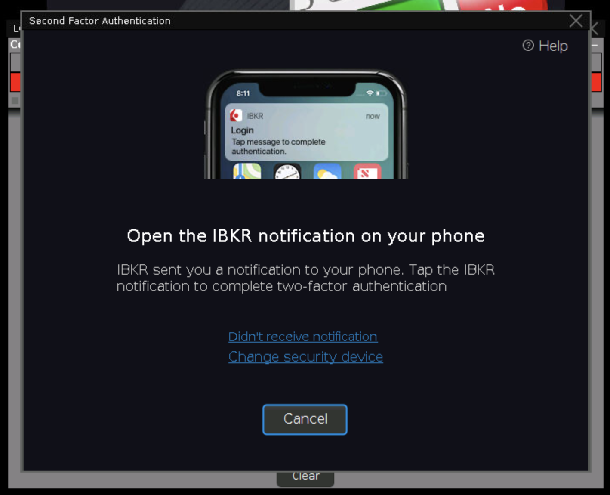

# IBGA Frequently Asked Questions
{: .no_toc }

  

    Table of contents
  

  {: .text-delta }
1. TOC
{:toc}

---

## What OS does IBGA support?

IBGA is a self-sufficient image. It runs on Docker. <a href="https://docs.docker.com/engine/install/" target="_blank">Docker is available on a variety of Linux platforms, macOS, and Windows 10</a>.

---

## What makes IBGA different from IBC?

<a href="https://github.com/IbcAlpha/IBC" target="_blank">IBC</a> automates many aspects of the Interactive Broker trading software. It is, however, not designed to run in a headless server. Before I started on IBGA, I spent plenty of time trying to make IBC work inside a container but couldn't reliably do so.

Technically, IBC is a Java program hosting the IB Gateway main class. Certain aspects of IBC can only be done via reverse-engineering how IB Gateway works. IBGA on the other hand, uses two-component automation: one to extract UI coordinates, and another to simulate input. It is a more efficient way to achieve automation, and I don't need to reverse-engineer the app.

---

## Can I host IBGA on an internet server?

**Not recommended.**{: .text-red-200 } Please refer to [Security](references/security.md) to learn about the potential issues of hosting IBGA on a public server.

---

## How is two-factor authentication (Interactive Brokers Secure Login System SLS) handled in IBGA?

Interactive Brokers now enforces two-factor authentication for trading. As a result, IBGA's login procedure can no longer be fully automated. The easiest second factor (whether you have a physical password device or not) is to configure IB Key on your phone (<a href="https://guides.interactivebrokers.com/iphone/log_in/activating_ios.htm" target="_blank">iPhone</a>, <a href="https://guides.interactivebrokers.com/androidphone/log_in/activating_ios.htm" target="_blank">Android</a> Guide). Once this is configured, you will see the following IBGA screen (via VNC) upon login, right after IBGA automatically enters the password.

Your phone will receive a push notification where you can tap and allow the login.

IBGA can support physical password devices too, in which case, you have to open up the VNC in a browser (generally a computer is preferred over a phone) to enter the password according to instructions.

In both scenarios, the confirmation has to be done within 2 minutes. If you didn't complete the login, IBG will return to the initial login screen.

Note that if you have more than one device (for instance, an IB Key on phone and a physical device), you will be presented with a choice, in which case, you have to open up the VNC in a browser and choose "IB Key" before you receive a push notification. By default, IBGA will not touch second factor device choices. But by [setting IB_PREFER_IBKEY environment variable to "true"](references/config-args.md#IB_PREFER_IBKEY), IBGA will automatically choose IB Key when there are more than one choices, enabling simple confirmation without VNC.

---

## How do I run multiple instances of IB Gateway on the same server?

In the [example configuration](getting-started/configuring.md#an-example-docker-compose-configuration-file), only one service node (`my-ibga`) is created. Within the context of IBGA, one service is one container running one instance of IB Gateway. Running another instance needs another service node, with different ports. For example:

    version: '2'
    services:
      my-ibga:
        ...
        environment:
          ...
          - IB_USERNAME=username_account1
          ...
        ports:
          - "15800:5800"
          - "4000:4000"
      my-other-account:
        ...
        environment:
          ...
          - IB_USERNAME=username_account2
          ...
        ports:
          - "15801:5800"
          - "4001:4000"

However, you cannot share live account market data subscriptions with the paper trading account using this method. For market data sharing to work, both IB Gateway instances must share the same <a href="https://en.wikipedia.org/wiki/MAC_address" target="_blank">NIC MAC address</a>, which IBGA does not currently support.

---

## How do I export logs to a non-settings directory on the host?

First, log exporting is configured using the [`IBGA_EXPORT_LOGS`](references/config-args.html#IBGA_EXPORT_LOGS) variable. To export into a custom directory, mount it in `docker-compose.yml` like the program and settings directory, and set [`IBGA_LOG_EXPORT_DIR`](references/config-args.html#IBGA_LOG_EXPORT_DIR) respectively:

    version: '2'
    services:
      my-ibga:
        image: ibga
        environment:
          ...
          - IBGA_EXPORT_LOGS=true
          - IBGA_LOG_EXPORT_DIR=/home/ibg_logs
        volumes:
          - ./run/program:/home/ibg
          - ./run/settings:/home/ibg_settings
          - ./run/logs:/home/ibg_logs

---

## Why Xvfb but not the modern xserver-xorg-video-dummy as the framebuffer?

Mainly the size. Switching to `xserver-xorg-video-dummy` adds about 30MB of additional dependencies to the image without any improvement to the functionality whatsoever.

---

## Can I distribute IBGA as a commercial product?

IBGA is available under the [GPLv3](https://www.gnu.org/licenses/gpl-3.0.en.html){:target="_blank"} license as well as a commercial license. Users choosing to use IBGA under the free, open-source license must comply with its terms. Alternatively, users may choose to purchase a commercial license, which enables the distribution of IBGA in any form without restrictions.

Please contact `heshiming at gmail dot com` for the commercial licensing option.

---

## How to setup TOTP (Mobile Authenticator App) automated login?

<a href="https://ibkrguides.com/securelogin/sls/mobile-authenticator.htm" target="_blank">IBKR Mobile Authenticator</a> is a form of two-factor authentication via a common standard, software based solution. It generates a 6-digit numeric passcode calculated using a pre-shared secret and the current time.

Since late 2023, new accounts at IBKR would be prompted to use Mobile Authenticator Apps as the first option of second factor login. Upon login, the IBKR Portal will show a QR code (containing a shared secret generated by IBKR) asking you to use an app to scan it, and then enter the 6-digit passcode to confirm.

In this guide, we will use the <a href="https://2fas.com" target="_blank">2FAS</a> app as the Mobile Authenticator App, because it is open-source and the secret keys can easily be exported. If you choose to use a commercial app such as <a href="https://shieldplanet.com/extract-secret-keys-from-google-authenticator-qr-code/" target="_blank">Google Authenticator</a>, you will generally face some difficulty in exporting those secret keys because the designer of the program does not let you easily move to an alternative (No it has nothing to do with security per se). And even though 2FAS is available on both iOS and Android, it is easier to copy a file from Android as for iOS, you still need to connect a cable and use iTunes to transfer the backup file.

Once you used 2FAS app to obtain Mobile Authenticator access, <a href="https://2fas.com/support/2fas-mobile-app/i-want-to-move-copy-transfer-tokens-codes-between-ios-and-android/">use its export function to export the key to a "local 2FAS backup file"</a>. Copy this .2fas file to a computer. It is in fact a text file which you can open using a text editor. Its content is similar to this:

    { "services":
      [
        { "name":"Interactive Brokers",
          "secret":"XXXXXXXXXXXXXXXXXXXXXXXXXXXXXXXX",
          "updatedAt":17249840000000,
          "otp":
            {
              "link":"otpauth://totp/Interactive Brokers:username?secret=XXXXXXXXXXXXXXXXXXXXXXXXXXXXXXXX&issuer=Interactive Brokers",
              "label":"username",
              "account":"username",
              "issuer":"Interactive Brokers",
              "tokenType":"TOTP",
              "source":"Link"
            },
            "order":{"position":0},"icon":{"selected":"Label","label":{"text":"IN","backgroundColor":"Brown"},"iconCollection":{"id":"id"}}}
        ],
      "groups":[],"updatedAt":17249840000000,"schemaVersion":4,"appVersionCode":5000022,"appVersionName":"5.4.5"
    }

The part marked as "X" in the above content is your 32-character secret key (generated by IBKR, received via the QR code at 2FAS). Once you obtained it, you can use the `TOTP_KEY` environment variable in the docker-compose configuration:

    services:
      my-ibga:
        image: ibga
        environment:
          ...
          - TOTP_KEY=XXXXXXXXXXXXXXXXXXXXXXXXXXXXXXXX

And IBGA will automatically generate and enter the 6-digit passcode for you. Generation of the code is done by a third-party program named <a href="https://www.nongnu.org/oath-toolkit/oathtool.1.html" target="_blank">oathtool</a>.

Note that if your account is already using IB Key or Printed/Digital Keycode Card, there is currently no way to switch to Mobile Authenticator App (as of November 2024).

