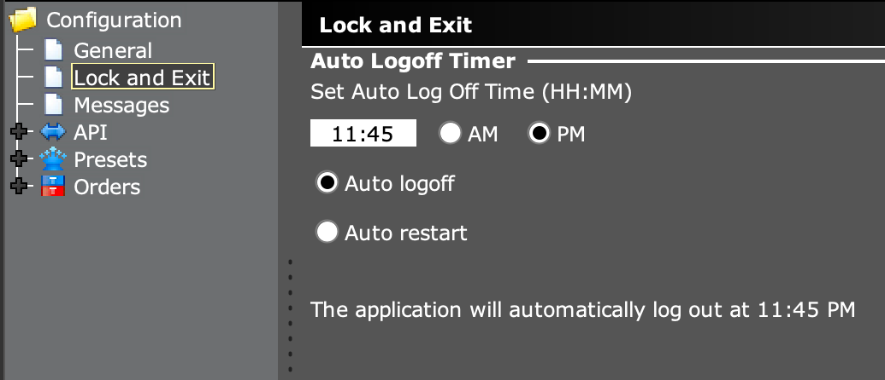

# Running IBGA (Docker Compose flavor)

## Starting Your IBGA Containers

Once you have your [`docker-compose.yml` configuration](configuring.md) ready, running IBGA is as simple as:

    $ sudo docker-compose up -d

Or if you named your configuration otherwise:

    $ sudo docker-compose -f my-own-config.yml up -d

If the IBGA docker image is not downloaded at this point, Docker Compose will automatically pull it for you before creating the container.

The `-d` argument tells Docker Compose to launch the container in the background (as in "daemon"). If you are just testing out IBGA, you can omit this argument so that the container occupies your console. In this case, interrupting via Ctrl+C or disconnecting from the shell will kill the container. For more information regarding `docker-compose` command line arguments, please refer to the <a href="https://docs.docker.com/compose/reference/" target="_blank">official documentation</a>.

If you followed [the default configuration](configuring.md#an-example-docker-compose-configuration-file) where `restart: unless-stopped` is set, the container will always be up with the host unless you manually shut down the container or Docker.

In [the default configuration](configuring.md#an-example-docker-compose-configuration-file), two ports `15800` and `4000` are exposed:

| Port | Function | Note |
| `15800` | Browser-based VNC client to inspect container running status. | Access via http://ip:15800/ in a browser. Made possible by <a href="https://novnc.com/" target="_blank">novnc</a> |
| `4000` | IB API server port | Internal mapping (via <a href="https://linux.die.net/man/1/socat" target="_blank">socat</a>) is done to allow any IP address to connect. |

**When your container is up and running, it is a good time to pay attention to [security](../references/security.md). Understanding security is critical to keep you safe trading.**

## Understanding How Daily Restarts are Handled

IB Gateway is designed to restart everyday. It does so by letting you choose a fixed time for restarts, and an option for either restart IBG or quit.

IBGA handles daily restarts by:

1. Passing `docker-compose.yml` to IB Gateway via simulating user interface actions.
2. Forcing the "Auto logoff" option, instead of "Auto restart"
3. Detect whether IBG is still running every 5 seconds, and start it again if not.

It is important to understand that the settings in the above screenshots are managed by IBGA and should not be manually altered.

## Understanding How Crashes and Freezes are Handled

Since the daily restart handling routines are already detecting if IBG is running, a crash is handled the same way as daily restarts.

Freezes are much harder to detect. First, freezes are rare. When it happens, the underlying automation dependency <a href="https://heshiming.github.io/jauto/" target="_blank">JAuto</a> is still working, and can still enumerate UI widgets. In fact, even socket APIs could be partially working. A programmatic way to detect a freeze would require user interaction every few seconds, which can be cumbersome. The current IBGA implementation approximates freeze detection by allowing IB Gateway to run for 24 hours (in fact, 86520 seconds) at most. If IBG is still running after 24 hours, IBGA will kill it (`kill -9`). Health check routines will pick up the quit and try to start it again.

My own experience is that IB Gateway is only likely to freeze after the market closes on the paper trading account. Such a mechanism only solves freezes once a day but can specifically address this issue.

